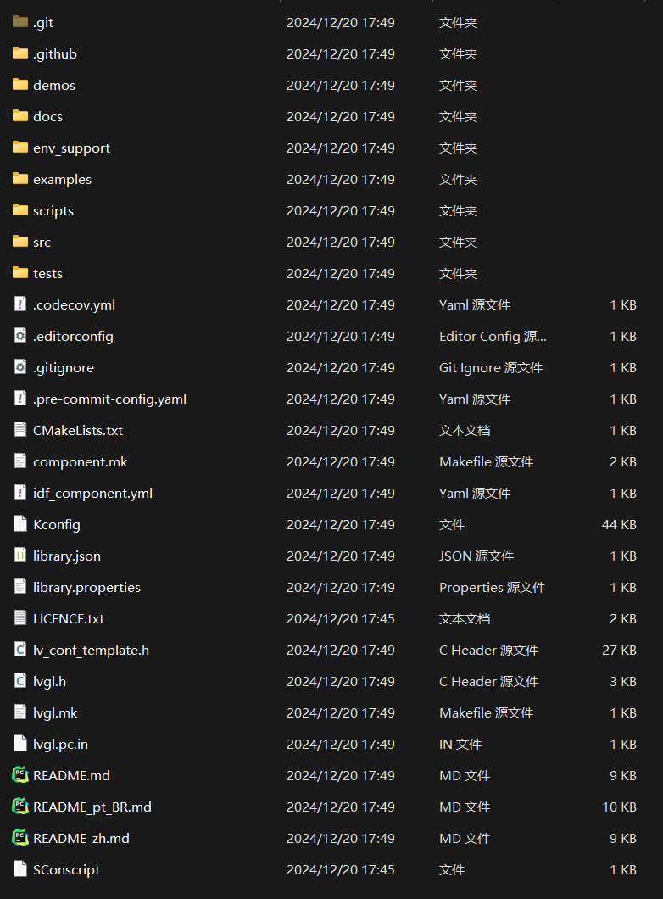
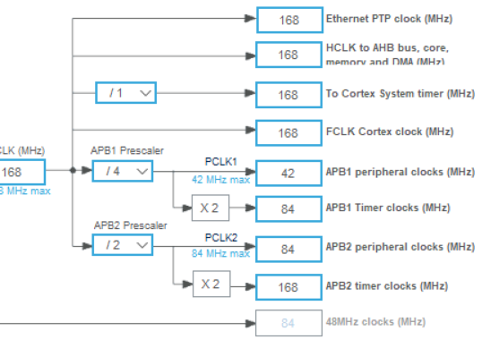
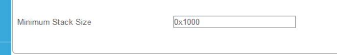
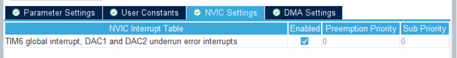
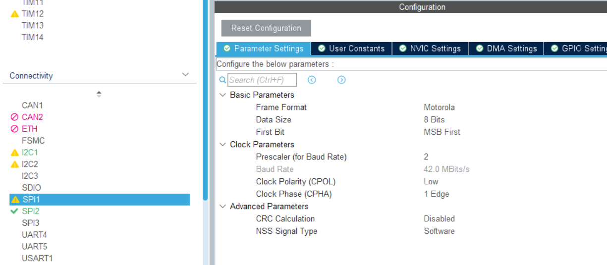
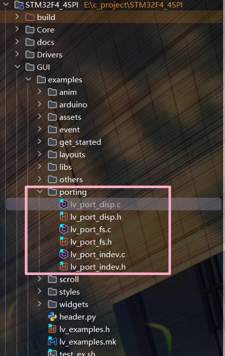

## LVGL踩坑日记
使用STM32F407VET6的SPI1进行SPI通信半双工
### 1.先git lvgl的官方库文件
    
这里我使用的是8.4版本
```git
git clone https://github.com/lvgl/lvgl.git
cd lvgl
git checkout v8.4
```

下载完成后会得到一个如图所示的文件结构



### 2.生成项目代码

#### 2.1 定时器配置
- 由于lvgl需要一个周期1ms的信号老保持心跳，所以使用定时器

  - Tout= ((arr+1)*(psc+1))/Tclk；
  - arr：计数重装值，psc分频数，Tclk系统时钟频率，Tout一个周期的时间。

- 
- 使能的定时器为TIM6，TIM6的时钟频率为84MHz，所以Tclk=84MHz，Tout=1ms，所以psc=84-1=83，arr=1000-1=999，所以TIM6的配置如下：
- 
- 使能定时器函数
- 
        
#### 2.2 SPI配置
- 使用ABH1总线上的spi1，速度能快一点
- 

#### 2.3 设置堆栈大小

- 

### 3.文件导入

- 将lvgl文件夹下的文件导入到工程中,在项目根目录下直接运行auto_lvgl.py文件
- 然后进入GUI文件夹下的lv_conf.h，启用该文件
- 在进入GUI/examples/porting文件夹，启用其中的所有文件
- 
- 打开其中的lv_port_disp.c
```c
/**
* @file lv_port_disp_templ.c
*
*/

/*Copy this file as "lv_port_disp.c" and set this value to "1" to enable content*/
#if 1  //将0 改为1即可启用

/*********************
*      INCLUDES
*********************/
#include "lv_port_disp.h"
#include <stdbool.h>
#include "st7796.h"  // 导入屏幕驱动文件
/*********************
*      DEFINES
*********************/

#define MY_DISP_HOR_RES 320  // 屏幕宽度
#define MY_DISP_VER_RES 480  // 屏幕高度
// 这里有个宏定义，是自己定义的


//#ifndef MY_DISP_HOR_RES
//    #warning Please define or replace the macro MY_DISP_HOR_RES with the actual screen width, default value 320 is used for now.
//    #define MY_DISP_HOR_RES    320
//#endif
//
//#ifndef MY_DISP_VER_RES
//    #warning Please define or replace the macro MY_DISP_HOR_RES with the actual screen height, default value 240 is used for now.
//    #define MY_DISP_VER_RES    240
//#endif
//上面的直接注释了
```

```c
void lv_port_disp_init(void)
{
    /*-------------------------
     * Initialize your display
     * -----------------------*/
    disp_init();

    /*-----------------------------
     * Create a buffer for drawing
     *----------------------------*/

    /**
     * LVGL 需要一个缓冲区，用于在内部绘制 widget。
     * 稍后，此缓冲区将传递给显示驱动程序的“flush_cb”，以将其内容复制到显示器。
     * 缓冲区必须大于 1 个显示行
     *
     * 有 3 种缓冲配置：
     * 1.创建一个缓冲区：
     * LVGL 将在此处绘制显示屏的内容并将其写入您的显示屏
     *
     * 2.创建 TWO 缓冲区：
     * LVGL 会将显示器的内容绘制到缓冲区并将其写入您的显示器。
     * 您应该使用 DMA 将缓冲区的内容写入显示器。
     * 它将使 LVGL 能够将屏幕的下一部分绘制到另一个缓冲区，同时
     * 数据正在从第一个缓冲区发送。它使渲染和刷新并行。
     *
     * 3.双缓冲
     * 设置 2 个屏幕大小的缓冲区并设置 disp_drv.full_refresh = 1。
     * 这样 LVGL 将始终以 'flush_cb' 提供整个渲染屏幕
     * 并且你只需要更改帧缓冲区的地址。
     */
//这里有三个缓冲区
//这里我使用的是2缓冲区
//根据自己的需求选择
    /* Example for 1) */
//    static lv_disp_draw_buf_t draw_buf_dsc_1;
//    static lv_color_t buf_1[MY_DISP_HOR_RES * 10];                          /*A buffer for 10 rows*/
//    lv_disp_draw_buf_init(&draw_buf_dsc_1, buf_1, NULL, MY_DISP_HOR_RES * 10);   /*Initialize the display buffer*/

//    /* Example for 2) */
    static lv_disp_draw_buf_t draw_buf_dsc_2;
    static lv_color_t buf_2_1[MY_DISP_HOR_RES * 10];                        /*A buffer for 10 rows*/
    static lv_color_t buf_2_2[MY_DISP_HOR_RES * 10];                        /*An other buffer for 10 rows*/
    lv_disp_draw_buf_init(&draw_buf_dsc_2, buf_2_1, buf_2_2, MY_DISP_HOR_RES * 10);   /*Initialize the display buffer*/

//    /* Example for 3) also set disp_drv.full_refresh = 1 below*/
//    static lv_disp_draw_buf_t draw_buf_dsc_3;
//    static lv_color_t buf_3_1[MY_DISP_HOR_RES * MY_DISP_VER_RES];            /*A screen sized buffer*/
//    static lv_color_t buf_3_2[MY_DISP_HOR_RES * MY_DISP_VER_RES];            /*Another screen sized buffer*/
//    lv_disp_draw_buf_init(&draw_buf_dsc_3, buf_3_1, buf_3_2,
//                          MY_DISP_VER_RES * LV_VER_RES_MAX);   /*Initialize the display buffer*/

    /*-----------------------------------
     * Register the display in LVGL
     *----------------------------------*/

    static lv_disp_drv_t disp_drv;                         /*Descriptor of a display driver*/
    lv_disp_drv_init(&disp_drv);                    /*Basic initialization*/

    /*Set up the functions to access to your display*/

    /*Set the resolution of the display*/
    disp_drv.hor_res = MY_DISP_HOR_RES;
    disp_drv.ver_res = MY_DISP_VER_RES;

    /*Used to copy the buffer's content to the display*/
    disp_drv.flush_cb = disp_flush;

    /*Set a display buffer*/
    
    //注意：这里的缓冲区是2缓冲区，所以是draw_buf_dsc_2
    disp_drv.draw_buf = &draw_buf_dsc_2;
}
```

```c
/*初始化您的显示器和所需的外围设备.*/
static void disp_init(void)
{
    ST7796S_LcdInit(); //驱动文件中屏幕初始化函数

}
```

```c
static void disp_flush(lv_disp_drv_t * disp_drv, const lv_area_t * area, lv_color_t * color_p)
{
    if(disp_flush_enabled) {
        /*最简单的情况（也是最慢的）将所有像素逐个放到屏幕上*/

        int16_t x;
        int16_t y;
        for(y = area->y1; y <= area->y2; y++) {
            for(x = area->x1; x <= area->x2; x++) {
                /*Put a pixel to the display. For example:*/
                /*put_px(x, y, *color_p)*/
                LCD_DrawPixel(x, y, color_p->full);  // 注意：这里是颜色值，不是颜色指针，需要指向full
                color_p++;
            }
        }
    }
    /*IMPORTANT!!!
     *通知图形库您已准备好进行刷新*/
    lv_disp_flush_ready(disp_drv);
}
```
- 再打开Drivers/STM32F4xx_HAL_Driver/Src/stm32f4xx_hal_tim.c

```c
//__weak void HAL_TIM_PeriodElapsedCallback(TIM_HandleTypeDef *htim)
//{
//  /* Prevent unused argument(s) compilation warning */
//  UNUSED(htim);
//
//  /* NOTE : This function should not be modified, when the callback is needed,
//            the HAL_TIM_PeriodElapsedCallback could be implemented in the user file
//   */
//}
// 以上是原代码，弱定义了一个回调函数，可以在main.c中重写，但是Clion好像不认识这个若定义，会显示报错，所
// 直接注释了，下面重定义了，当定时器溢出时调用这个回调函数 lv_tick_inc(1)是lvgl的心跳，每1ms 调用一次

void HAL_TIM_PeriodElapsedCallback(TIM_HandleTypeDef *htim){
    if (htim->Instance == TIM6)
        {
        lv_tick_inc(1);
        }
}
```

main.c
```c
  MX_TIM6_Init();
  HAL_TIM_Base_Start_IT(&htim6);  // 开启定时器6中断

  lv_init();
  lv_port_disp_init();
  HAL_Delay(1000);
  
  while (1)
  {
      lv_example_get_started_1();
      HAL_Delay(500);
      lv_example_btnmatrix_1();
      HAL_Delay(500);
      lv_task_handler();  // 调用lvgl的任务处理函数

  }
```
